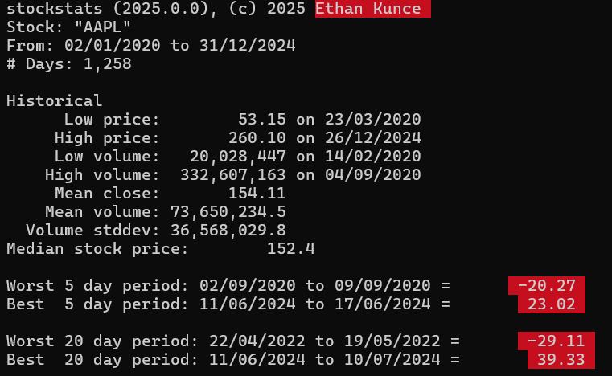

# benchP
```cpp
#include <iostream>
#include "benchP.hpp"

int main(int argc, char * argv[])
{
    // you can initialize a benchP object with a string path of the executable file
    benchP profProgram("E:\\bootstrapBenchmark\\bootstrapBenchmarkV4\\stockstatsGarth.exe AAPL.csv");

    // an arguements parameter can be passed, if you do not want to concatenate it to the executable file
    benchP myProgram("E:\\bootstrapBenchmark\\bootstrapBenchmarkV4\\stockstats.exe", "AAPL.csv");
    
    // we can create our own user input, \r\n is how windows reads new lines and how we seperate userInputs
    std::string userInput{ "53\r\nquit\r\n" };

    // we can also get a user input from std::cin
    //std::cin >> userInput; 
     
    // then you must write the userInput into our stringstream buffer and it will read as user input
    myProgram.buffer << userInput;

    profProgram.buffer << userInput;

    myProgram.runChild();
    profProgram.runChild();

    // if the program does not terminate automatically, the process will hang and run until a interupt is sent (ctrl + c). 
    // if your program requires userInput to quit, then ensure that you write a quit case into the buffer. 

    std::cout << "myProgram" << std::endl << myProgram << std::endl;
    // program input is read from the buffer, it is cleared, then it is written to the buffer. 
    //std::cout << myProgram.buffer.str() << std::endl;                 

    std::cout << "profProgram" << std::endl << profProgram << std::endl;
    //std::cout << profProgram.buffer.str() << std::endl;
    // we can print the programs output by calling the programs public stringstream buffer instance and printing it as a string. 

    // this is a custom function written to show the output differences between p1, and p2.
    compareOutput(profProgram, myProgram);

    return 0;
}
```

## writing benchP object to ostream
```cpp
    std::cout << "myProgram" << std::endl << myProgram << std::endl;
```
printing the object to the ostream will print the executable file, args, cpu time used, and Wall time used.
```bash
E:\bootstrapBenchmark\bootstrapBenchmarkV4\stockstatsGarth.exe AAPL.csv  CPU time: 15.00ms. Wall time: 14.90ms.
```


```cpp
compareOutput(profProgram, myProgram);
```


